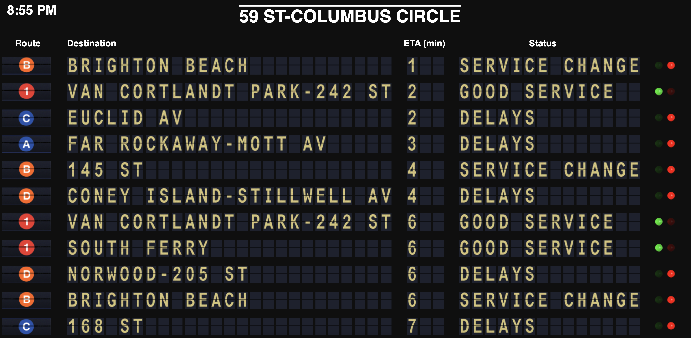

# Virtual Split-Flap Display — NYC Subway

This project is a **web-based simulation of a split-flap (Solari) display** showing **real-time NYC Subway arrivals**. It uses animated CSS sprites to emulate physical split‑flap boards and pulls live data from the **Transiter API**.

The project can run **locally** or as a **hosted multi-page website** (e.g., Replit), supports **all 499 NYC subway stations**, and is designed for both **horizontal and vertical displays**.

---

## Key Features
- Real-time NYC Subway arrivals
- Authentic split-flap animation using CSS sprites
- Station selector with search (499 stations)
- Per-station arrival board with routes, destination, ETA, and service status
- Configurable refresh intervals, row counts, and sorting
- Optimized for kiosks, wall displays, and fullscreen setups

---

## Architecture Overview

### Frontend
- **Home Page** (`public/index.html`)
- **Display Page** (`public/display.html`)
- Libraries: jQuery, Underscore.js, Backbone.js

### Backend
- **Node.js / Express (`app.js`)**
  - `/api/stations`
  - `/api/stations/:stationId/arrivals`
  - Direct Transiter API integration
  - Built-in caching

**Note:** Python subprocess removed as of December 2025.

---

## Customization
- Rows: `app.js` (~30), `display.html` (~109–112)
- Refresh: 20s backend + frontend
- Sorting: time, route, destination

---

## Credits
- Split-flap template inspired by baspete
- Transit data powered by Transiter

# Virtual Split-Flap Display — Deployment

## Current State
- Multi-page website
- Always-on VM deployment
- Node.js only (no Python subprocess)

---

## Replit Configuration
- Command: `bash start.sh`
- Port: `5000`
- Deployment: VM

---

## Backend Summary
- Express server (`app.js`)
- Endpoints:
  - `/api/stations`
  - `/api/stations/:stationId/arrivals`
- Caching, route colors, service alerts

---

## Architecture Notes (Dec 2025)
- Removed Python fetch loop
- Simplified deployment
- Faster responses
